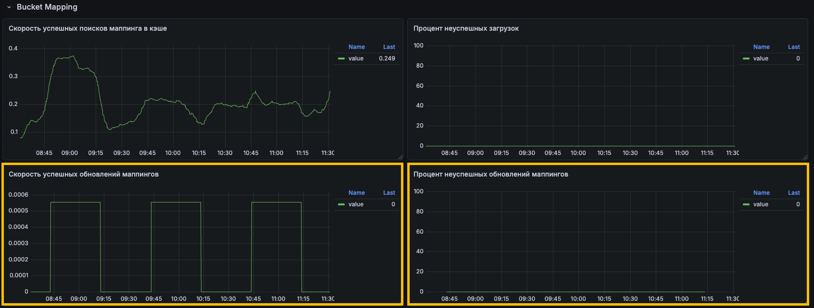
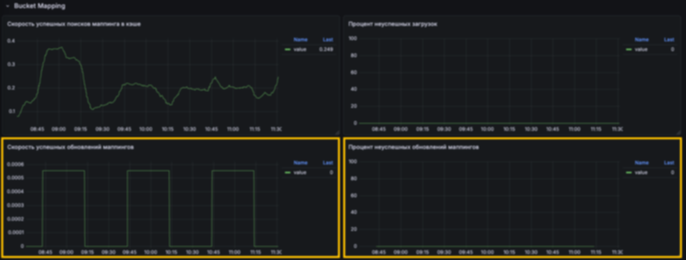
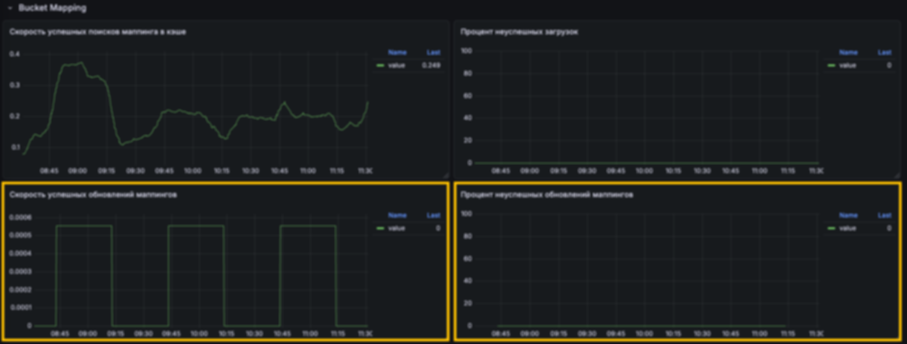
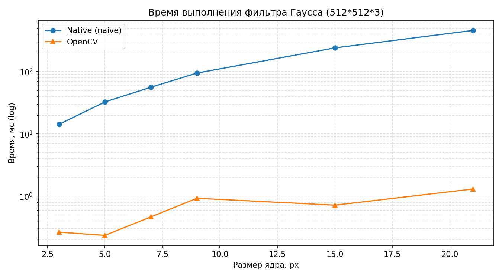

# Лабораторная работа: Усредняющий фильтр Гаусса

**Вариант:** усредняющий фильтр Гаусса с переменным размером ядра и параметрами гауссианы.

## Цель работы

Научиться реализовывать один из простых алгоритмов обработки изображений.

## Задачи

1. Реализовать фильтр Гаусса в двух вариантах:
   - с использованием встроенной функции `cv2.GaussianBlur` (OpenCV);
   - нативно на Python + NumPy (прямая свёртка).
2. Сравнить быстродействие реализаций.
3. Подготовить отчёт.

---

## 1. Теоретическая база

**Фильтр Гаусса** — линейный сглаживающий фильтр, ядро которого задаётся
двумерной функцией Гаусса:

$$
G(x, y) = \frac{1}{2\pi\sigma^{2}} \exp\!\left(-\frac{x^{2}+y^{2}}{2\sigma^{2}}\right)
$$

где `σ` — стандартное отклонение, `(x, y)` — координаты относительно центра
ядра. На практике ядро дискретизируется на решётке `size × size`
(`size` — нечётное) и **нормируется** так, чтобы сумма всех элементов
равнялась единице. Это гарантирует сохранение средней яркости изображения.

**Свёртка** изображения `I` с ядром `K`:

$$
I'(x, y) = \sum_{i=-k}^{k} \sum_{j=-k}^{k} K(i, j)\,I(x+i, y+j), \quad k = \lfloor size/2 \rfloor
$$

Ключевые свойства гауссова ядра:

1. **Изотропность** — размытие не зависит от направления, что выгодно
   отличает фильтр Гаусса от, например, box-фильтра.

---

## 2. Описание разработанной системы

### 2.1 Архитектура

```
src/
├── native_filter.py     # нативная реализация (прямая свёртка)
├── opencv_filter.py     # обёртка над cv2.GaussianBlur
└── utils.py             # I/O, метрики MSE/PSNR
main.py                  # демонстрация
benchmark.py             # замеры времени
```

### 2.2 Алгоритмы

**Нативная реализация (naive)** — двойной цикл по элементам ядра:

```python
for i in range(size):
    for j in range(size):
        result += kernel[i, j] * padded[i:i+h, j:j+w]
```

Границы обрабатываются через `np.pad(mode="reflect")`.
Сложность — `O(H·W·size²)`.

**OpenCV** — `cv2.GaussianBlur` использует оптимизированный C++ код
(векторизация SIMD, внутренняя сепарабельность, граничные условия
`BORDER_REFLECT`).

### 2.3 Параметры

- размер ядра `size ∈ {3, 5, 7, 9, 15, 21}` (нечётные);
- `σ = 0.3·size` — эмпирическое правило, при котором ядро покрывает ≈3σ;
- поддержка grayscale и RGB.

---

## 3. Результаты работы и тестирования

### 3.1 Визуальное сравнение

| Оригинал | Native (size=7, σ=2.1) | OpenCV |
|---|---|---|
|  |  |  |

**Численное расхождение с OpenCV:**

```
PSNR(native    vs opencv) ≈ 52 dB
MSE (native    vs opencv) ≈ 0.30
```

Разница объясняется отличиями в граничных условиях и округлением `uint8` —
это визуально неразличимо (PSNR > 40 dB считается неотличимым).

### 3.2 Быстродействие

Замеры на изображении **512×512×3**, `σ = 0.3·size`, минимум из 3 запусков:

| size | Native, ms | OpenCV, ms | Ускорение OpenCV vs naive |
|:----:|-----------:|-----------:|--------------------------:|
| 3    | 14.25      | 0.27       | ×53                       |
| 5    | 32.63      | 0.24       | ×136                      |
| 7    | 56.19      | 0.47       | ×120                      |
| 9    | 94.88      | 0.93       | ×102                      |
| 15   | 240.30     | 0.72       | ×334                      |
| 21   | 458.22     | 1.30       | ×353                      |



**Закономерности:**

1. **Native (naive)** растёт как `size²` — от 3 до 21 время выросло
   примерно в **32 раза** (14 → 458 мс).
2. **OpenCV** стабильно на 2–3 порядка быстрее native: даже при `size=21`
   обработка занимает ~1 мс. Ускорение растёт с ростом ядра, что
   подтверждает эффективную реализацию (C++/SIMD).

> Примечание: времена OpenCV на малых ядрах (0.24–0.93 мс) шумят из-за
> погрешности тайминга на коротких интервалах; тренд ускорения при этом
> сохраняется.

### 3.3 Влияние параметров

- Рост `σ` при фиксированном `size` почти не меняет время — только форму
  ядра.
- Рост `size` при фиксированном `σ` увеличивает время, но
  визуальный эффект почти не меняется (краевые веса ~0) — отсюда
  правило `size ≈ 6σ + 1`.

---

## 4. Выводы

1. Реализованы две независимые версии гауссова размытия: нативная
   (NumPy) и на базе OpenCV. Их результаты совпадают с точностью
   PSNR ≈ 52 дБ — расхождение определяется только граничными условиями
   и округлениями.
2. Встроенная функция `cv2.GaussianBlur` быстрее нативной реализации
   в **50–350 раз** в зависимости от размера ядра за счёт:
   - компилируемого C++/SIMD-кода;
   - внутренней сепарабельности;
   - эффективной работы с памятью.
3. Получено эмпирическое подтверждение асимптотики `O(size²)` для
   naive-свёртки: время растёт квадратично с размером ядра.
4. **Практический вывод:** для задач реального времени следует
   использовать OpenCV; нативная реализация полезна для обучения,
   отладки и случаев, когда внешние зависимости недопустимы.

---

## 5. Использованные источники

1. OpenCV Documentation — `cv2.GaussianBlur`:
   https://docs.opencv.org/4.x/d4/d86/group__imgproc__filter.html
2. NumPy Reference: https://numpy.org/doc/stable/
3. PSNR и SSIM или как работать с изображениями под С. — Хабр, 2011. — URL: https://habr.com/ru/articles/126848/
4. Фильтр Гаусса на стероидах: секреты ускорения вычислений. — Хабр, 2025. — URL: https://habr.com/ru/companies/smartengines/articles/877082/
5. Фильтр Гаусса на стероидах: подход на точность вычислений. — Хабр, 2025. — URL: https://habr.com/ru/companies/smartengines/articles/883340/

---

## Запуск

```bash
pip install -r requirements.txt

# демонстрация
python main.py --image images/sample.jpg --size 7 --sigma 2.0 --out out

# бенчмарк
python benchmark.py
```